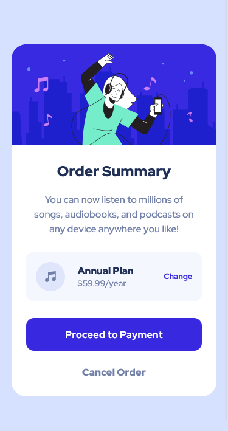

# Frontend Mentor - Order summary card solution

This is a solution to the [Order summary card challenge on Frontend Mentor](https://www.frontendmentor.io/challenges/order-summary-component-QlPmajDUj). Frontend Mentor challenges help you improve your coding skills by building realistic projects.

## Table of contents

- [Overview](#overview)
  - [The challenge](#the-challenge)
  - [Screenshot](#screenshot)
  - [Links](#links)
- [My process](#my-process)
  - [Built with](#built-with)
  - [What I learned](#what-i-learned)
  - [Continued development](#continued-development)
  - [Useful resources](#useful-resources)
- [Author](#author)
- [Acknowledgments](#acknowledgments)

## Overview

### The challenge

Users should be able to:

- See hover states for interactive elements

### Screenshot

### Links

- Solution URL: [Project on GitHub](https://github.com/joanFaseDev/order-summary)
- Live Site URL: [Project hosted through Vercel](https://order-summary-beryl.vercel.app/)

## My process

### About me

Hi everyone! I have to warn you about two things. First and foremost, english isn't my first language so please forgive me for any mispellings or grammatical errors. Secondly, i'm an aspiring front-end developper so i'm far from being the best learning material. Yet i'll do my best to explain my process, which choices i did and for what reasons.

### Analysis

The project is about recreating as closely as possible an order summary card based on two designs, a mobile and a desktop one. The layout inside the card doesn't change much between the two designs but the ratio height/width is clearly different. There's few elements inside, an image, some text, a tiny card about an annual plan and two buttons.

### Planning

Here's how i'll proceed:

- Create a _main_ element to act as a flexbox container.
- Create four _section_ elements to act as flexbox items and also to enhance accessibility through semantic tag's use.
- Write all contents in HTML file then proceed to implement basic styling (font-size, body's padding and margin reset, colors) and css variables.
- Using flexbox properties, lay out the four main parts of the card (roughly distribute space and align items ) then work on smooth transition from mobile design to desktop one.
- Once the transition is satisfying, go in details and try to replicate as closely as possible the padding / margin of the template.

### Built with

- Semantic HTML5 markup
- CSS custom properties
- Flexbox

### What I learned

- How to hide content from users but not from screen readers using a precise combinaison of css properties (cf. style.css .sr-only). From what i understood, this method is limited to specific situations and i'm not quite sure this project is one of them. I used _section_ elements and sections must have title. Unfortunately they can't appear on the card and yet they must be readable by assisting technologies (otherwise, that defeat the very purpose of using _section_ element ). So i hid them but maybe i should'nt have used _section_ in the first place. I'll try to ask others Frontend's members for specifics.
- I discovered the [text-underline-offset](https://developer.mozilla.org/en-US/docs/Web/CSS/text-underline-offset) property to change the space between a text and its decoration. What's amazing with CSS is the sheer number of property the language have! There's litterally properties for everything.
- I started to apply basic knowledge of CSS variables. I recently learned about 'custom properties' and it was my first project actually using them. I like the syntax, a tad long but simple and easy to remember.

### Continued development

I wished to keep practicing using ems, rems and view units because in my mind it's one of the keys for creating good responsive design. I also want to learn more about accessibility and the various ways we can tweak our designs to improve the experience of the few as much as the many.

### Useful resources

- [Medium article on semantic tags by Elson Correia](https://medium.com/before-semicolon/10-html-semantic-tags-and-when-to-use-them-5ae7d7d0b0f2) - This article helped me clarify how _article_ and _section_ elements works and what's the differences between them. It also provided nice intel on others semantic tags.
- [Article by Amani Ali on how hiding elements can improve accessibility](https://www.nomensa.com/blog/how-improve-web-accessibility-hiding-elements) - This article helped me understand how to hide elements from the user but not from the various assisting technologies.

## Author

- Frontend Mentor - [@joanFaseDev](https://www.frontendmentor.io/profile/joanFaseDev)
